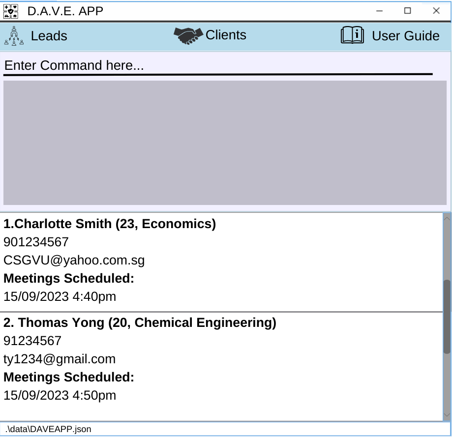

# Welcome to D.A.V.E. (**D**’financial **A**d**V**isor **E**xpert)

*Manage your leads and clients information effortlessly through D.A.V.E. to gain an edge in your FA journey!*

D.A.V.E. is a leads and clients management tool for student financial advisors specifically in NUS, but can be used for all student financial advisors.

Here’s a quick overview of D.A.V.E.’s features

- Store and edit information of your leads and clients
- Convert successful leads into clients
- Manage clients’ policies
- Delete policies and leads
- Reminders such as upcoming meetings with leads/clients

# Table of Contents

- [Glossary](#Glossary)
- [Tutorial for new users](#D.A.V.E.-Tutorial-for-new-users)
- [Features](#Features)

# Glossary

## Definitions

Here are some descriptions of the words we use throughout the User Guide:

| Term | Definition |
| --- | --- |
| Command | An input from the user that tells D.A.V.E. to perform an action (e.g. add a client). |
| GUI | Graphical User Interface (GUI) refers to the visual display of D.A.V.E that users can see. |
| CLI | Command Line Interface (CLI) represents a text-based user interface to interact with the application. |

# D.A.V.E. Tutorial for new users

1. Ensure you have Java `11` or above installed in your computer.
2. Download the latest `DAVE.jar` from here.
3. Copy the file to the folder you want to use as the *home folder* for D.A.V.E.
4. Double-click `DAVE.jar` to start the app.

# Features

## Lead features

### Add lead [Coming soon]

- What it does: Add potential leads and their basic information, e.g. name, age, year of study, major, etc.
- Command format: `add --name <name> --age <age> --year <year of study> --major <major>`.
- Example usage: `add --name Dave --age 22 --year 2 --major Psychology`.
- Acceptable values for each parameter:
    - `name`: can contain any character, up to 100 characters long.
    - `age`: any integer between `1` and `100` inclusive.
    - `year`: any integer between `1` and `5` inclusive.
    - `major`: can contain any character, up to 50 characters long.
- Precise expected outputs when the command succeeds:

`Lead added. <lead details>`

- Precise expected outputs when the command fails:

`Lead failed to add. Please enter a valid command`

### View all clients

- What it does: View all clients you have stored, including their basic information and index in the list of leads, e.g. id, name, age, gender, occupation, etc.
- Command: `listclient`.
- Precise expected outputs when the command succeeds:

`List of all clients`

- Precise expected outputs when the command fails:

`Failed to view all clients. Please enter a valid command`

### View all leads

- What it does: View all leads you have stored, including their basic information and index in the list of leads, e.g. id, name, age, gender, occupation, etc.
- Command: `listlead`.
- Precise expected outputs when the command succeeds:

`List of all leads`

- Precise expected outputs when the command fails:

`Failed to view all leads. Please enter a valid command`

### Delete lead [Coming soon]

- What it does: Deletes a lead from your list of leads.
- Command format: `delete --id <id>`.
- Example usage: `delete --id 1`.
- Acceptable values for `id` parameter:
    - Must be an integer from `1` to the last index of the leads list
- Precise expected outputs when the command succeeds:

`Lead deleted: <lead details>`

- Precise expected outputs when the command fails:

`Lead failed to delete. Please enter a valid lead id`

### Add meeting time for lead [Coming soon]

- What it does: Adds a meeting time for a lead
- Command format: `addmeeting --lead <lead_id> --dt <datetime>`
- Example usage: `addmeeting --lead 1 --dt 23/9/2023 5:30PM`
- Acceptable values for each parameter:
    - `lead`: Any integer from `1` to the last index of the leads list
    - `dt`: A valid DateTime String with the format dd/M/yyyy hh:mma.
- Precise expected outputs when the command succeeds:

`Meeting time added to <lead> : <meeting datetime>`

- Precise expected outputs when the command fails:

`Meeting time failed to add. Please enter a valid lead id or meeting time`

### Delete meeting time for lead [Coming soon]

- What it does: Delete a meeting time for meetings that has been cancelled or postponed.
- Command format: `deletemeeting --lead <lead_id> --id <meeting_time_id>`
- Example usage: `deletemeeting --lead 1 --id 1`
- Acceptable values for each parameter:
    - `lead`: Any integer from `1` to the last index of the leads list
    - `id`: Any integer from `1` to the last index of the list
- Precise expected outputs when the command succeeds:

`Meeting time deleted from <lead> : <meeting datetime>`

- Precise expected outputs when the command fails:

`Meeting time failed to be deleted. Please enter a valid lead id or meeting time`
